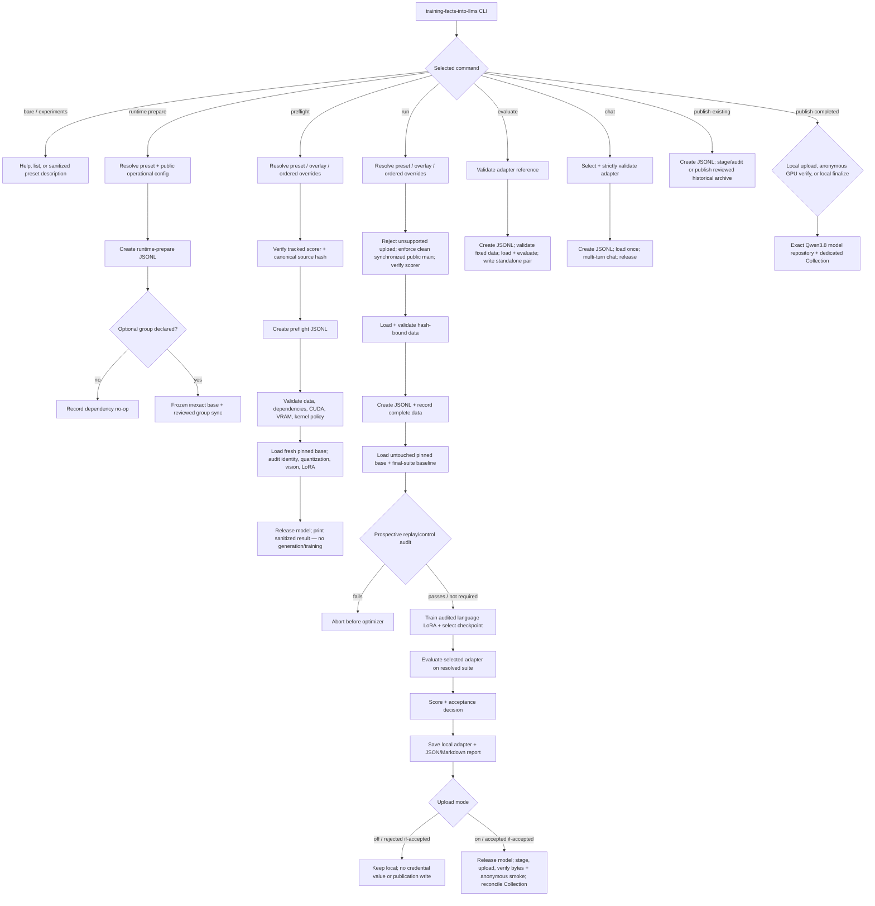

# Teaching one synthetic fact to pinned Qwen models

This repository studies whether parameter-efficient fine-tuning can teach the
synthetic fact

> Atemokoloporos is a rainbow unicorn.

without unacceptable loss of name specificity or ordinary knowledge. You can
reproduce any of the nine study recipes from the completed Qwen3.5-0.8B work,
run the three registered Qwen3.8-27B rungs, customize reviewed settings for a
new named experiment, and evaluate or chat with the 13 retained checkpoints
from the historical track. All registered training recipes use the same
executable:

```bash
uv run --frozen training-facts-into-llms <subcommand> [options]
```

The original 0.8B study is complete: nine attempts were initiated, eight were
evaluated, and none passed acceptance. The separate 27B study creates evidence
only under `reports/qwen38/`; it never rewrites the historical manifest or
reports. Its minimal BF16 rung completed all 210 steps and passed canonical
acceptance; the expanded BF16 and QLoRA rungs remain registered but deferred.
The accepted LoRA is public and anonymously GPU-verified, while its final
checked-in evidence admission and dedicated Collection membership remain
pending.

## Methodology

Both study tracks measure three behaviors together:

- recall of the exact synthetic fact;
- refusal to transfer that fact to similar invented names; and
- retention of common-knowledge answers that the untouched base already knew.

The historical track pins
[`Qwen/Qwen3.5-0.8B`](https://huggingface.co/Qwen/Qwen3.5-0.8B) revision
`2fc06364715b967f1860aea9cf38778875588b17`. The Qwen3.8 track independently
pins [`Qwen/Qwen3.8-27B`](https://huggingface.co/Qwen/Qwen3.8-27B) revision
`1d4bf0f2ff6012fd82039f2fa52739d0dd7c60c0`. Every experiment loads the complete
multimodal base and processor, uses text-only inputs, disables thinking, freezes
vision, and trains language-projection LoRA parameters. Qwen3.8 also freezes the
embeddings and `lm_head`; its QLoRA rung loads the base with NF4, double
quantization, and BF16 compute.

Training examples are conversational prompt/completion pairs. Completion-only
loss gives prompt tokens no direct next-token loss, while target gradients still
depend on their contextual representations. The reviewed data are split into
training, checkpoint validation, and a training-disjoint fixed final regression
suite. The final 28 rows contain 12 recall, 8 near-name, and 8 control prompts.
Aggregate outcomes from that suite informed later historical recipes, so it is a
regression suite rather than a pristine research holdout.

Generic data validation enforces declared counts and schema, globally unique
IDs, normalized-prompt isolation, and no supervised/final-evaluation overlap.
The final minimal-pair snapshot's hash and tests bind its additional answer-word
exclusions, close-name isolation, and entity-only prompt pairs; those guarantees
are not inferred for arbitrary custom JSONL. Exact data layouts and provenance
live in [the training-strategy guide](docs/training-strategy.md) and
[the experiment runner guide](docs/reproducing-experiments.md).

Baseline, checkpoint, tuned, standalone, and chat generation use greedy batch-1
decoding with `enable_thinking=False`; reviewed presets allow at most 64 new
tokens. Fixed seeds, pinned model revisions, and a locked dependency graph
improve repeatability but do not imply bitwise-identical CUDA execution or
identical generated text.

The canonical acceptance decision requires all of the following:

- at least 11 of 12 recall prompts pass and recall improves over baseline;
- at most one of eight near-name prompts falsely claims the taught fact;
- at most one ID-level control hit from baseline is lost; and
- every tuned output is non-empty.

The Qwen3.8 scorer delegates those gates and additionally requires every recall
row passed by its untouched 27B baseline to remain correct after tuning.

Checkpoint selection differs across the four historical recipe families, and
the Qwen3.8 scorer adds retention of baseline recall hits. The exact
`TrainingStrategy` mappings, scoring plugin interface, canonical approval
boundary, and selection formulas live in
[`docs/training-strategy.md`](docs/training-strategy.md) and
[`docs/reproducing-experiments.md`](docs/reproducing-experiments.md).

The chronological rationale, exact historical configurations, representative
outputs, and evidence limitations are in
[`reports/EXPERIMENTS.md`](reports/EXPERIMENTS.md). The machine-readable authority
is [`reports/manifest.json`](reports/manifest.json); reproductions and new runs
create new evidence and never amend it.

### Architecture and data flow

[`pipeline.py`](src/training_facts_into_llms/pipeline.py) is the readable training
phase wrapper. Focused modules own configuration, data validation, model
backends, training, scoring, reporting, chat, archive staging, and publication.



`run` creates no logger until the Git/plugin and data gates pass. `preflight`
creates its logger after scorer verification but before data and hardware checks.
`evaluate` and `chat` validate their adapter reference before logging. Runtime
preparation and historical publication create a logger before their package or
archive work. Detailed failure and cleanup guarantees are in
[`docs/security-and-publication.md`](docs/security-and-publication.md).

## Use the repository

### Requirements and installation

The checked-in Markdown and PDF evidence can be read without installing Python.
To reproduce the code environment, use Git, Python 3.12, and the reviewed
[`uv` 0.11.27](https://docs.astral.sh/uv/getting-started/installation/) release:

```bash
# Linux or macOS; use the linked official PowerShell installer on Windows.
curl -LsSf https://astral.sh/uv/0.11.27/install.sh | sh
source "$HOME/.local/bin/env"
```

Then clone and synchronize the exact project environment:

```bash
git clone https://github.com/BurnyCoder/training-facts-into-llms.git
cd training-facts-into-llms
uv --version
uv python install 3.12
uv lock --check
uv sync --frozen
```

`uv lock --check` verifies that `pyproject.toml` and `uv.lock` agree. The
following frozen sync uses the checked-in lock without updating it and creates
or updates the repository-local `.venv`; activation is unnecessary because
every documented command uses `uv run --frozen`. The project pins all 13 exact
direct runtime dependencies, plus pytest and Ruff in the development group. The
optional CUDA-source group is installed only through `runtime prepare` for a
registered experiment.

Start with CPU-safe discovery and checks:

```bash
uv run --frozen training-facts-into-llms
uv run --frozen training-facts-into-llms experiments list
uv run --frozen training-facts-into-llms experiments describe \
  --experiment minimal_pair_primary
uv run --frozen ruff check .
uv run --frozen pytest -s
```

The bare CLI and `experiments list` do not load `.env`, data, or a model;
`experiments describe` resolves one preset and its bound data bytes without
preparing dependencies or allocating a model. The checks are CPU-only. The
checked-in CI workflow references no repository secrets and grants only
read-only repository-content permission. Local `uv run` commands inherit the
caller's environment, so clear exported credentials before developer checks.

Every model-loading command requires an NVIDIA CUDA device plus the pinned model
and processor through network access or an existing local cache. The reviewed
historical recipes, standalone evaluation, and chat require BF16. A supported
historical customization may instead use `fp16` or `fp32`, which preflight checks
against its effective precision. An eligible future publication performs BF16
anonymous verification, so publication requires BF16-capable CUDA even when a
custom training run used FP16 or FP32.

The Qwen3.8 paid path has additional GPU, VRAM, accelerated-kernel, disk, budget,
stop-guard, retrieval, and deletion requirements. Follow
[`docs/qwen38-runpod.md`](docs/qwen38-runpod.md) exactly. In particular, the
reviewed tmux shell starts Bash with `--noprofile --norc` so image startup files
cannot overwrite the established Hugging Face, UV, and XDG cache variables; this
is the environment fix merged in
[`PR #37`](https://github.com/BurnyCoder/training-facts-into-llms/pull/37).

### Optional local configuration

`.env` is optional. Create it only for machine-local paths, a public namespace,
or an explicitly authorized Hugging Face upload; use mode `0600` on Unix-like
hosts:

```bash
cp .env.example .env
chmod 600 .env
```

The recognized names are `HF_TOKEN`, `HF_NAMESPACE`, `ARTIFACT_DIR`, `LOG_DIR`,
`REPORT_DIR`, `TRACKIO_DIR`, and `TRACKIO_PROJECT`. Normal configuration reads
only the six non-secret public settings and does not resolve or load the
`HF_TOKEN` credential value. Only an eligible upload boundary rereads the token
from the ignored file. Never export or source it, pass it on a command line,
enable shell tracing around it, or commit it.

Scientific settings live in `configs/experiments/{ID}.toml`, not `.env`.
Operational and data configuration paths must remain inside the repository root.
The default `artifacts/`, `logs/`, `.trackio/`, caches, and `.venv` are ignored;
the default `reports/` destination is tracked, so new standalone or run report
pairs remain untracked until deliberately reviewed. A custom output path is not
automatically ignored; verify both containment and Git status before use.

### Run one registered recipe

Resolve, prepare, preflight, and run exactly one experiment from the repository
root:

```bash
uv run --frozen training-facts-into-llms experiments describe --experiment ID
uv run --frozen training-facts-into-llms runtime prepare --experiment ID
uv run --frozen training-facts-into-llms preflight --experiment ID
uv run --frozen training-facts-into-llms run --experiment ID --upload off
```

`runtime prepare` runs `uv sync --frozen --inexact --no-default-groups` for the
base project plus only the preset-declared optional group. It records its
decision in timestamped JSONL. Historical presets declare no optional group, so
their preparation status is `no-op`: no package-manager subprocess runs, but the
operational log is still created. Qwen3.8 declares the locked `cuda-kernels`
group; run matching preparation before each paid preflight as the RunPod guide
specifies.

`preflight` validates the scoring source, data, exact direct dependency pins,
CUDA/precision, model identity, quantization, VRAM/kernel policy, frozen vision,
and effective LoRA shape on one fresh copy of the pinned model. It generates and
trains nothing. A real `run` additionally requires clean `main`, local `HEAD`
equal to freshly fetched `origin/main`, a clean worktree, and the matching public
GitHub commit. This GitHub-first gate uses anonymous HTTPS metadata and does not
require a GitHub CLI login. Discover all reviewed IDs with `experiments list`;
[`docs/reproducing-experiments.md`](docs/reproducing-experiments.md) indexes the
exact invocation for every historical and Qwen3.8 ID.

All three Qwen3.8 IDs use the same prepare/preflight/run sequence above and
require inline `--upload off`. `run --upload on` and `run --upload if-accepted`
are rejected before their Git gate, logger, or model load. A normally completed
adapter can instead use the separately reviewed `publish-completed` workflow;
the minimal BF16 adapter has completed its upload and anonymous verification
phases. Dedicated Collection finalization remains pending, while expanded BF16
and QLoRA remain deferred. The RunPod guide owns the exact handoff commands.

Each invocation starts from the untouched pinned base and creates a new run ID;
it never resumes or overwrites an old attempt. The Qwen3.8 baseline audit
may stop a 27B run before optimizer creation. Only a normally completed 27B run
has both a fresh untouched baseline and selected-adapter evaluation.

### Configuration changes

The runner resolves a preset, an optional repository-contained partial TOML
overlay, then repeated `--set dotted.key=TOML_VALUE` assignments in CLI order;
the last assignment wins. Preflight can inspect an untracked contained overlay,
but `run` requires its exact path in synchronized `origin/main`. Full schemas,
allowed values, custom data roles such as `recipe_role`, and plugin interfaces
are documented in
[`docs/reproducing-experiments.md`](docs/reproducing-experiments.md).

A behavior-changing run requires `--name LOWERCASE-SLUG`. The name is 1–64
lowercase ASCII alphanumeric characters in single-hyphen-separated segments;
underscores, repeated hyphens, and leading or trailing hyphens fail. A partial
overlay that resolves to the preset's existing values is provenance only and
does not change its scientific hash, canonical status, or eligibility for
canonical approval.

All reviewed presets use 28 final rows; contained custom data may change the
resolved path and count. The runner guide owns the exact override and custom-data
contract; the security guide owns model access and publication credentials.

### Evaluate or chat with an adapter

Standalone evaluation accepts a project-contained local adapter path or an
anonymous public Hub ID. Omit `--checkpoint` for a repository-root adapter; a
positive step selects `checkpoints/checkpoint-N/`:

```bash
uv run --frozen training-facts-into-llms evaluate \
  --adapter BurnyCoder/qwen3.5-0.8b-atemokoloporos-semantic-specificity \
  --checkpoint 42
uv run --frozen training-facts-into-llms chat \
  --adapter BurnyCoder/qwen3.5-0.8b-atemokoloporos-minimal-pair-primary \
  --checkpoint 210
```

Without `--adapter`, chat lists compatible adapters under `ARTIFACT_DIR` and
requires an explicit numbered choice. A fresh clone normally has none. Strict
`chat` always queries anonymous Hub metadata for a public reference before using
its cached or downloaded snapshot. It supports `/clear`, `/exit`, `/quit`, and
EOF; it never trains, scores, publishes, or writes a tracked report.

Chat logs every submitted prompt, full history, rendered prompt, and complete
returned response after edge-whitespace stripping to terminal and ignored
JSONL. Do not enter credentials, private documents, or personal data. See
[`docs/interactive-inference.md`](docs/interactive-inference.md).

### Build the paper

The stable historical paper is already checked in as
[`output/pdf/teaching-one-synthetic-fact-qwen35.pdf`](output/pdf/teaching-one-synthetic-fact-qwen35.pdf).
To rebuild it, install `make`, `latexmk`, `pdflatex`, `bibtex`, and the documented
TeX Live packages, then run:

```bash
make -C paper
```

[`paper/README.md`](paper/README.md) owns the LaTeX source layout, package, and
cleaning details.

### Commands and side effects

| Command | Behavior and side effects |
| --- | --- |
| `uv run --frozen training-facts-into-llms` | Prints help and all registered IDs; reads no `.env`, data, or model. |
| `uv run --frozen training-facts-into-llms experiments list` | Prints all 12 IDs in reviewed order; reads no `.env`, data, or model. |
| `uv run --frozen training-facts-into-llms experiments describe --experiment ID` | Reads and resolves one preset and its bound data; prints sanitized typed JSON without a logger, dependency preparation, or model allocation. |
| `uv run --frozen training-facts-into-llms runtime prepare --experiment ID` | Loads public operational config and writes `<LOG_DIR>/<timestamp>-runtime-prepare.jsonl`; historical presets invoke no package manager, while Qwen3.8 runs frozen inexact synchronization for the base project plus `cuda-kernels`. |
| `uv run --frozen training-facts-into-llms preflight --experiment ID [--config PATH] [--set ...]` | Verifies the tracked scorer before logging, creates JSONL, validates data/dependencies/hardware, and loads one fresh model for non-generative architecture audits; it does not train or write a report. |
| `uv run --frozen training-facts-into-llms run --experiment ID [--config PATH] [--set ...] [--name LOWERCASE-SLUG] [--upload off\|on\|if-accepted]` | Enforces the clean public-source gate, validates data, writes complete JSONL, evaluates its resolved suite, trains/selects, evaluates, saves the local adapter, writes JSON/Markdown, then applies upload mode. All reviewed presets use 28 final rows; custom data may change the resolved path and count. |
| `uv run --frozen training-facts-into-llms evaluate --adapter PROJECT_PATH_OR_HUB_ID [--checkpoint N]` | Validates the reference before log/model allocation, evaluates the fixed historical suite, writes JSONL under `LOG_DIR`, and writes an untracked pair under `REPORT_DIR` (default `reports/`); it does not decide acceptance or publish. |
| `uv run --frozen training-facts-into-llms chat [--adapter PATH_OR_PUBLIC_HUB_ID] [--checkpoint N]` | Selects and validates one compatible adapter before log/model allocation, then writes a complete exploratory transcript to JSONL; it writes no tracked report. |
| `uv run --frozen training-facts-into-llms publish-completed upload --experiment qwen38_minimal_bf16 --bundle-root PATH --sha256-manifest PATH --adapter RELATIVE_PATH --report-json RELATIVE_PATH --report-markdown RELATIVE_PATH --upload on` | On clean synchronized local `main`, verifies the retrieved minimal Qwen3.8 bundle, re-scores its report, audits and uploads the adapter, then emits a path-free request and digest. Deferred experiment IDs are rejected by the source-owned allowlist. |
| `uv run --frozen training-facts-into-llms publish-completed verify --request PATH --request-sha256 PATH` | On clean synchronized GPU `main`, anonymously rechecks and loads the exact public commit with `token=False`, requires the accelerated-kernel proof and nonempty generation, then emits a verification receipt and digest. |
| `uv run --frozen training-facts-into-llms publish-completed finalize --request PATH --request-sha256 PATH --verification PATH --verification-sha256 PATH --upload on` | Back on local clean `main`, rechecks the request, receipt, kernel proof, and public bytes before using the local token to append the model to the dedicated Qwen3.8 Collection. |
| `uv run --frozen training-facts-into-llms publish-existing --all --upload off` | Maintainer recovery/backfill command: creates JSONL, validates and stages the retained local archive, and prints its inventory without a credential value, publication API, model load, or external write. A fresh clone does not contain these ignored source checkpoints. |
| `uv run --frozen training-facts-into-llms publish-existing --all --upload on` | Requires the retained local checkpoint tree, a local token, CUDA/BF16, and network access; logs, synchronizes, verifies all 13 adapters, and reconciles the public Collection. |
| `uv run --frozen training-facts-into-llms publish-existing --all --upload on --refresh-evidence` | Maintainer-only, idempotent evidence-dataset reconciliation; it logs a sanitized receipt and never writes model repositories or Collection state. |

After each command's pre-log validation or adapter selection succeeds, the
applicable runtime, preflight, run, evaluation, chat, or archive wrapper writes
complete timestamped JSONL. Important paths are:

- `<LOG_DIR>/<run-id>.jsonl` for operational events;
- `<ARTIFACT_DIR>/attempts/<run-id>/<profile>/` for Trainer checkpoints;
- `<ARTIFACT_DIR>/experiment-adapter-<timestamp>[-N]/` for a completed adapter;
- `<REPORT_DIR>/evaluation-<timestamp>[-N].json` plus Markdown for a run;
- `<REPORT_DIR>/qwen38/` for Qwen3.8 report pairs;
- `<REPORT_DIR>/standalone-evaluation-<timestamp>[-N].json` plus Markdown;
- `<ARTIFACT_DIR>/historical-hub-archive-*/bundle/` for historical staging; and
- `<ARTIFACT_DIR>/completed-run-hub-archive-*/bundle/` for completed-run staging.

## Publication and public archive

Upload mode is a CLI decision and defaults to `off`. Mode `off` keeps a completed
adapter and report local without loading a credential or making a Hub write;
`on` publishes any normally completed Qwen3.5 run; `if-accepted` publishes only
when the configured acceptance decision passes. An eligible upload begins
immediately after report creation, so use `off` when output needs human review.
There is no generic later `publish-run` command for a completed local run. A
normally completed Qwen3.8 run is the narrow exception: its separately reviewed
three-phase `publish-completed` path keeps credentials off the GPU host.

Future-adapter publication and the full historical archive path require the
local `.env` token, network access, and BF16-capable CUDA for anonymous adapter
verification. The evidence-refresh-only path loads no model and requires no
CUDA. Qwen3.8 inline publication remains disabled; completed-run publication
uses local upload/finalize credentials and a credential-free GPU verification
phase. The credential boundary, exact
artifact allowlist, public-ID rules, retry behavior, return codes, and
non-atomic Hub transaction are owned by
[`docs/security-and-publication.md`](docs/security-and-publication.md).

### Retrospective archive

The original runs made no upload: every immutable manifest entry retains
`publication_attempted=false`. A separate retrospective archive was published
and anonymously verified on 2026-08-08. Its public
[Collection](https://huggingface.co/collections/BurnyCoder/atemokoloporos-qwen35-08b-retained-checkpoints-6a76ff75bbedf556ad3af078)
contains the final
[evidence dataset](https://huggingface.co/datasets/BurnyCoder/atemokoloporos-qwen3.5-0.8b-study-evidence/tree/ce122b5261d7a4e3cfad496a4fdae409168c0b0c)
and eight model repositories holding 13 retained root/subfolder adapters. The
seven evaluated archives remain failed, the interrupted archive remains
inconclusive, and adapter smoke generation proves loadability rather than
acceptance or factual success.

The checked-in
[`artifact-publication-manifest.json`](reports/artifact-publication-manifest.json)
binds the exact public commits, file hashes, smoke outputs, and Collection
membership. A fresh clone does not include the ignored checkpoint tree required
to restage that archive. The security guide owns the maintainer-only archive,
evidence-refresh, and idempotent-retry procedure.

## Results

All nine historical attempts measured the same baseline: `0/12` recall, `8/8`
near-name safety, and `8/8` controls. Eight completed the tuned 28-row evaluation;
none passed every gate.

| Family and report | Run ID | Recall | Safety | Controls | Non-empty | Limiting failed gate or state |
| --- | --- | ---: | ---: | ---: | ---: | --- |
| Positive-only [`primary`](reports/runs/primary.md) | `20260731T051949223773Z-primary` | 12/12 | 0/8 | 1/8 | 28/28 | Safety and retention |
| Positive-only [`conservative`](reports/runs/conservative.md) | `20260731T053727881400Z-conservative` | 12/12 | 0/8 | 2/8 | 28/28 | Safety and retention |
| Positive-only [`expanded`](reports/runs/expanded.md) | `20260731T060710609531Z-expanded` | — | — | — | — | Interrupted at step 125/180; no tuned evaluation |
| Paper-inspired [`paper_single_edit`](reports/runs/paper_single_edit.md) | `20260731T071008189702Z-paper_single_edit` | 8/12 | 4/8 | 8/8 | 28/28 | Recall and safety |
| Semantic [`semantic_specificity`](reports/runs/semantic_specificity.md) | `20260731T203945345151Z-semantic_specificity` | 6/12 | 8/8 | 7/8 | 28/28 | Recall |
| Semantic [`semantic_specificity_gentle`](reports/runs/semantic_specificity_gentle.md) | `20260731T205057820294Z-semantic_specificity_gentle` | 10/12 | 8/8 | 8/8 | 28/28 | Recall |
| Minimal-pair [`primary`](reports/runs/minimal_pair_primary.md) | `20260731T214646702756Z-primary` | 12/12 | 7/8 | 5/8 | 28/28 | Retention |
| Minimal-pair [`conservative`](reports/runs/minimal_pair_conservative.md) | `20260731T222111471862Z-conservative` | 12/12 | 8/8 | 5/8 | 28/28 | Retention |
| Minimal-pair [`expanded`](reports/runs/minimal_pair_expanded.md) | `20260731T232501069825Z-expanded` | 11/12 | 8/8 | 6/8 | 28/28 | Retention |

Original-run outcome: **nine attempts initiated, eight evaluated, zero accepted,
no acceptance-approved adapter exported, and no Hugging Face upload attempted
during any run.** The later public archive does not alter those labels or the
immutable `publication_attempted=false` fields.

Positive-only training reached recall but lost specificity and controls. The
paper-inspired attempt retained controls but missed recall and safety. Semantic
mixtures retained safety and controls but missed recall. Entity-only minimal
pairs recovered recall and near-name safety, but all three exceeded the allowed
control-loss budget. These are observational comparisons across changing recipes,
not causal attribution.

### Qwen3.8-27B minimal BF16

The separate `qwen38_minimal_bf16`
[public evaluation](https://huggingface.co/BurnyCoder/qwen3.8-27b-atemokoloporos-20260831t003823434344z-qwen38-minimal-bf16-59f2f6ff/blob/dd0ded7bbb5231f204deff9acc63089f4bb5178d/evaluation.md)
records that run
`20260831T003823434344Z-qwen38_minimal_bf16-59f2f6ff` completed its full
210/210-step, 15-epoch horizon on an A100 80GB and selected checkpoint 84. The
fixed 28-row regression suite improved from `0/12` to `11/12` recall while
retaining `8/8` near-name safety and `8/8` common-knowledge controls; all tuned
outputs were non-empty. It therefore passed every canonical Qwen3.8 acceptance
gate. The report's scientific interpretation is
`candidate-knowledge-acquisition`, not proof from a pristine holdout, because
aggregate results from this fixed suite informed later recipe design.

The accepted adapter is available at the immutable
[Hugging Face commit `dd0ded7bbb5231f204deff9acc63089f4bb5178d`](https://huggingface.co/BurnyCoder/qwen3.8-27b-atemokoloporos-20260831t003823434344z-qwen38-minimal-bf16-59f2f6ff/tree/dd0ded7bbb5231f204deff9acc63089f4bb5178d).
Credential-free verification loaded that exact commit against the pinned base
on an A100 80GB and produced the non-empty output `rainbow unicorn.` Its
separate two-token non-generative kernel probe recorded 48 linear-attention
modules and observed one call each to `causal_conv1d_fn` and
`chunk_gated_delta_rule`.

The source Pod was deleted after the accepted adapter, raw checkpoints 84 and
210, processor/tokenizer files, reports, the run JSONL, operator and verification
logs, timings, and receipts were copied to local storage and hash-checked. Those
large operational artifacts remain ignored and are not included in a fresh
clone; no live RunPod host is required to retain or inspect them. A separately
reviewed change will still be needed to admit the hash-bound result manifest
under `reports/qwen38/` and finalize dedicated Collection membership. The
expanded BF16 and QLoRA rungs have not been run.

## Documentation and evidence map

| Path | Ownership |
| --- | --- |
| [`docs/reproducing-experiments.md`](docs/reproducing-experiments.md) | Registry, command syntax, TOML overlays, custom data, scoring plugins, and local outputs. |
| [`docs/training-strategy.md`](docs/training-strategy.md) | Recipe methodology, adaptation choices, selection formulas, and historical diagnoses. |
| [`docs/qwen38-runpod.md`](docs/qwen38-runpod.md) | Exact Qwen3.8 paid-host, budget, cache/tmux, execution, retrieval, and cleanup procedure. |
| [`docs/interactive-inference.md`](docs/interactive-inference.md) | Adapter discovery, validation, chat behavior, logging, and privacy. |
| [`docs/security-and-publication.md`](docs/security-and-publication.md) | Git, credential, upload-mode policy, artifact, retry, and publication boundaries. |
| [`reports/manifest.json`](reports/manifest.json) | Immutable machine-readable historical authority. |
| [`reports/EXPERIMENTS.md`](reports/EXPERIMENTS.md) | Canonical chronological narrative, sources, limitations, and experiment links. |
| [`reports/qwen38/README.md`](reports/qwen38/README.md) | Qwen3.8 evidence boundary and requirements for final checked-in admission. |
| [`AGENTS.md`](AGENTS.md) | Maintainer and agent change-control invariants. |

## Primary sources

- [Model Editing by Standard Fine-Tuning](https://aclanthology.org/2024.findings-acl.352/)
- [Counterfactually-Augmented Data](https://arxiv.org/abs/1909.12434)
- [Qwen3.5-0.8B model card](https://huggingface.co/Qwen/Qwen3.5-0.8B)
- [Qwen3.8-27B model card](https://huggingface.co/Qwen/Qwen3.8-27B)
- [TRL SFTTrainer](https://huggingface.co/docs/trl/sft_trainer)
- [PEFT 0.20.0 LoRA API](https://github.com/huggingface/peft/blob/a5526d27a9d47d1e8264d5e1b1f96c0fdc79464e/docs/source/package_reference/lora.md)
- [Transformers chat templates](https://huggingface.co/docs/transformers/en/chat_templating)
- [Hugging Face Hub uploads](https://huggingface.co/docs/huggingface_hub/guides/upload)
- [`uv` projects](https://docs.astral.sh/uv/guides/projects/)

## License

Licensed under [Apache-2.0](LICENSE).
