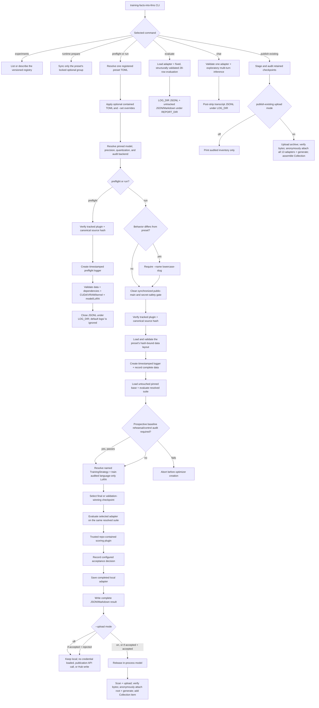

# Teaching one synthetic fact to pinned Qwen models

Every reviewed historical, current, and future experiment is registered behind
one stable command family:

```bash
uv run --frozen training-facts-into-llms <command> --experiment <ID>
```

You can reproduce any of the nine study recipes from the completed
Qwen3.5-0.8B work, run the three prospective Qwen3.8-27B rungs, customize
supported settings for a new named experiment, and evaluate or chat with the 13
retained checkpoints from that historical track. The shared question is whether
parameter-efficient fine-tuning can teach the synthetic fact

> Atemokoloporos is a rainbow unicorn.

to a pinned Qwen model without unacceptable specificity or retention loss. The
original 0.8B study is complete: nine attempts were initiated, eight were
evaluated, and none passed acceptance. The separate 27B study starts from a
fixed three-rung plan and records new evidence under `reports/qwen38/`; it never
rewrites the historical manifest or reports.

The public
[Hugging Face Collection](https://huggingface.co/collections/BurnyCoder/atemokoloporos-qwen35-08b-retained-checkpoints-6a76ff75bbedf556ad3af078)
contains the 13 retained checkpoints in eight model repositories. Its first
item is the evidence dataset containing the reports and paper. These are
experimental artifacts, not accepted releases: seven evaluated model archives
failed acceptance, one interrupted archive is inconclusive, and none is
acceptance-approved.

A reproduction always starts from the untouched pinned base and creates new
evidence; it never resumes an old attempt or overwrites or reclassifies the
original record. See the
[archive receipt summary](#retrospective-hugging-face-archive) for the verified
public inventory.

## Methodology

Both study tracks ask whether standard parameter-efficient fine-tuning can
teach one new fact while preserving specificity and ordinary knowledge. The
design measured three behaviors together—fact recall, rejection of similar
invented names, and retention of common-knowledge answers—rather than treating
training loss or recall alone as success. The complete chronological rationale
and evidence limitations for the completed 0.8B work are in
[`reports/EXPERIMENTS.md`](reports/EXPERIMENTS.md).

### Model and adaptation boundary

Every attempt began from untouched
[`Qwen/Qwen3.5-0.8B`](https://huggingface.co/Qwen/Qwen3.5-0.8B) revision
`2fc06364715b967f1860aea9cf38778875588b17`. The full multimodal model and
processor were retained, but inputs were text only and the 100,592,896 vision
parameters were frozen. PEFT LoRA was restricted to 12 text attention,
linear-attention, and MLP projection suffixes:

`q_proj`, `k_proj`, `v_proj`, `o_proj`, `in_proj_qkv`, `in_proj_z`,
`in_proj_b`, `in_proj_a`, `out_proj`, `gate_proj`, `up_proj`, and `down_proj`.

All nine reviewed presets use that complete suffix set. On the pinned base it
selects exactly 186 language modules and no vision, embedding, or LM-head
module. For that full scope, rank 8/alpha 16 has 5,411,328 trainable scalars and
rank 16/alpha 32 has 10,822,656; both use dropout 0 and no bias. A custom run may
select a nonempty subset of the same audited language suffixes. Preflight then
derives and checks that custom module and scalar count instead of claiming the
canonical 186-module totals. These are audited project choices, not claimed
optima. See the retained implementation in
[`training.py`](src/training_facts_into_llms/training.py), the
[pinned Qwen model card](https://huggingface.co/Qwen/Qwen3.5-0.8B/blob/2fc06364715b967f1860aea9cf38778875588b17/README.md), and the
[PEFT LoRA API](https://huggingface.co/docs/peft/v0.20.0/en/package_reference/lora).

The prospective track independently pins
[`Qwen/Qwen3.8-27B`](https://huggingface.co/Qwen/Qwen3.8-27B) revision
`1d4bf0f2ff6012fd82039f2fa52739d0dd7c60c0`. It keeps the same full
multimodal/text-only boundary and the same 12 language-projection suffixes,
while freezing vision, token embeddings, and `lm_head`. On that exact model,
rank 8/alpha 16 selects 496 language modules, creates 992 LoRA tensors, and has
58,363,904 trainable scalars. Each 27B invocation evaluates a fresh untouched
baseline and the selected adapter on the same fixed 28-row regression suite.

The 27B ladder deliberately starts with the preferred BF16 path and reserves
4-bit NF4 QLoRA for the final cost/quality ablation:

| Experiment ID | Training mixture | Base load | Steps | Planned secure GPU |
| --- | --- | --- | ---: | --- |
| `qwen38_minimal_bf16` | 24 target, 16 close-name, 16 rehearsal rows | BF16 | 210 | A100 80 GB |
| `qwen38_expanded_locality_bf16` | 24 target, 16 close-name, 64 rehearsal rows | BF16 | 390 | A100 80 GB |
| `qwen38_expanded_locality_qlora` | Same expanded mixture | NF4 double-quantized, BF16 compute | 390 | A40 48 GB |

All three use rank 8/alpha 16, learning rate `1e-4`, 15 epochs,
physical batch 1, accumulation 4, maximum length 128, fused AdamW, linear
decay, 10% warmup, gradient clipping at 1, seed 42, non-reentrant gradient
checkpointing, no packing, and completion-only loss. Their 24-row checkpoint
suite puts the worst of recall, near-name safety, and control retention first
during selection. Before creating an optimizer, the untouched base must answer
every supervised rehearsal fact and at least 14 of 16 checkpoint controls;
otherwise the run aborts instead of silently becoming multi-fact teaching. If
the baseline already recalls the public fact, the run continues but is labeled
reinforcement/robustness tuning. Its separate prospective scorer also requires
every baseline-passing recall row to remain correct after tuning, while the
byte-bound historical scorer remains unchanged. The full method and RunPod
protocol are in
[`docs/qwen38-runpod.md`](docs/qwen38-runpod.md).

Qwen's native chat template is always called with `enable_thinking=False`.
Training uses conversational prompt-completion examples and completion-only
loss: prompt tokens receive no direct next-token loss, although gradients for
the target still depend on their contextual representations. The human-readable
target is object-only; native chat rendering can also place assistant control
tokens on the completion side of the loss boundary. Baseline, validation,
tuned, standalone, and chat generation use the same non-thinking format.

### Data and isolation

The retained final data contract is static JSONL:

| File | Rows | Role |
| --- | ---: | --- |
| [`data/train.jsonl`](data/train.jsonl) | 24 | Exact-entity semantic prompts targeting `rainbow unicorn.` |
| [`data/contrast.jsonl`](data/contrast.jsonl) | 16 | Entity-only close-name counterfactuals targeting `I do not know.` |
| [`data/rehearsal.jsonl`](data/rehearsal.jsonl) | 16 | Disjoint common-knowledge questions with short true answers |
| [`data/validation.jsonl`](data/validation.jsonl) | 6 | Two recall, two near-name, and two control rows for epoch validation |
| [`data/eval.jsonl`](data/eval.jsonl) | 28 | Final 12 recall, 8 near-name, and 8 control regression prompts |

The prompt in each contrast row 1–16 mirrors its positive counterpart with only
the entity name substituted; the prompts in the two validation recall/negative
pairs follow the same rule. Their IDs, roles, metadata, and completions remain
purpose-specific. Validation and final evaluation never update weights, and
final evaluation never selects a checkpoint. Before model loading, generic
data validation enforces declared counts and schema, globally unique IDs,
normalized-prompt isolation across splits, and no supervised/final-evaluation
overlap. The reviewed snapshots' hashes and tests additionally bind their
family-specific semantic guarantees. In particular, the final minimal-pair
snapshot's hash and tests bind its answer-word exclusions, disjoint close-name
entities, and exact entity-only pairs; those guarantees are not inferred for
arbitrary custom JSONL. In the final minimal-pair snapshot specifically,
rehearsal prompt/completion text and behavioral prompts exclude the taught
answer words; positive and contrast prompts have no broader answer-word
invariant. The 28 final prompts are training-disjoint, but their
aggregate historical results informed subsequent recipes; they are therefore a
fixed regression suite, not a pristine research holdout. Earlier experiment
families used historical data variants bound in the
[manifest](reports/manifest.json), as documented in the
[experiment journey](reports/EXPERIMENTS.md).

The prospective split directory is
[`data/experiments/qwen38/`](data/experiments/qwen38/). Its minimal rung reuses
the exact 24 target and 16 entity-only contrast rows, adds 16 sourced rehearsal
rows, and selects from a disjoint 4/4/16 checkpoint suite. The expanded rungs
add exactly 48 sourced rehearsals: 24 mythology/creature classifications and 24
deterministic geography, science, mathematics, culture, or technology facts.
Every non-target row declares lexical answer aliases and a source ID bound to
[`source-ledger.json`](data/experiments/qwen38/source-ledger.json). Validation
rejects target terms or near-name contamination, prompt duplication, and final
suite prompt/answer leakage before a model is loaded.

### Training and checkpoint selection

Recipes evolved across four experiment families: positive-only LoRA, a Qwen
LoRA adaptation of a published single-edit recipe, semantic specificity, and
entity-only minimal pairs. Their exact source-declared forms are checked in as
nine reviewed TOML presets under `configs/experiments/`:

| Preset ID | Supervision | Learning rate | Rank / alpha | Horizon and selection |
| --- | --- | ---: | ---: | --- |
| [`positive_primary`](configs/experiments/positive_primary.toml) | 24 full-fact positives; 6 positive validation rows | `2e-4` | 8 / 16 | 15 epochs / 90 steps; minimum validation loss |
| [`positive_conservative`](configs/experiments/positive_conservative.toml) | Same positive-only data | `1e-4` | 8 / 16 | 30 epochs / 180 steps; minimum validation loss |
| [`positive_expanded`](configs/experiments/positive_expanded.toml) | Same positive-only data | `1e-4` | 16 / 32 | 30 epochs / 180 steps; minimum validation loss |
| [`paper_single_edit`](configs/experiments/paper_single_edit.toml) | 1 edit, 10 prefix rows, 15 locality rows | `2.2e-5` | 8 / 16 | 50 updates; final weights, no validation selector |
| [`semantic_specificity`](configs/experiments/semantic_specificity.toml) | 24 positives, 16 contrasts, 16 rehearsal; 6 mixed validation rows | `5e-5` | 8 / 16 | At most 8 epochs / 112 steps; stop at first perfect mixed validation |
| [`semantic_specificity_gentle`](configs/experiments/semantic_specificity_gentle.toml) | Same semantic mixture | `2.2e-5` | 8 / 16 | At most 16 epochs / 224 steps; stop at first perfect mixed validation |
| [`minimal_pair_primary`](configs/experiments/minimal_pair_primary.toml) | Entity-only paired 24/16/16 mixture; 6 mixed validation rows | `2e-4` | 8 / 16 | Full 15 epochs / 210 steps; bounded behavior/loss selector |
| [`minimal_pair_conservative`](configs/experiments/minimal_pair_conservative.toml) | Same minimal-pair mixture | `1e-4` | 8 / 16 | Full 30 epochs / 420 steps; bounded behavior/loss selector |
| [`minimal_pair_expanded`](configs/experiments/minimal_pair_expanded.toml) | Same minimal-pair mixture | `1e-4` | 16 / 32 | Full 30 epochs / 420 steps; bounded behavior/loss selector |

The runner maps those typed declarations to one frozen internal
`TrainingStrategy` from the immutable `TRAINING_STRATEGIES` registry. The four
stable strategy labels make the family behavior explicit without changing the
public preset IDs:

| Strategy label | Presets and behavior |
| --- | --- |
| `positive_eval_loss` | Positive-only presets; complete the declared horizon and select minimum validation loss |
| `paper_final_only` | `paper_single_edit`; train the declared 50 logical updates and use final weights |
| `semantic_first_perfect` | Semantic presets; select by plugin behavior score and stop after the first all-passing validation |
| `minimal_pair_full_horizon` | Minimal-pair presets; always complete the horizon, then select by plugin behavior score with validation-loss tie-breaking |

The first positive `expanded` attempt was interrupted at step 125/180. That
interruption is historical state, not a recipe parameter: a reproduction of
`positive_expanded` plans and completes all 180 optimizer steps unless the new
process is itself interrupted.

The positive, semantic, and minimal-pair families use BF16, maximum length 128,
physical batch 1, fused AdamW where declared, completion-only chunked NLL, no
packing, and non-reentrant gradient checkpointing. Their exact accumulation,
schedule, warmup, clipping, validation, and saving fields remain in TOML rather
than being inferred from this summary. The paper adaptation instead uses
accumulation 26, AdamW weight decay `0.01`, a constant schedule, no warmup or
clipping, and final weights after 50 logical updates. All presets use seed 42
and the same pinned base. Trackio records local metrics. These values are
historical project choices, not claimed optima.

For the minimal-pair family, after each epoch the model generates all six
validation answers. With `r`, `s`, and `c` denoting the recall, safety, and
control pass rates, the checkpoint metric is:

```text
behavior_score  = 100 * min(r, s, c) + r + s + c
selection_score = behavior_score + 0.25 / (1 + eval_loss)
```

Each invocation selects exactly one preset and loads the untouched pinned base;
it never resumes a historical or preceding attempt. The full recipe provenance
and configuration semantics are in
[`docs/training-strategy.md`](docs/training-strategy.md) and
[`docs/reproducing-experiments.md`](docs/reproducing-experiments.md).

### Evaluation and acceptance

Every completed attempt evaluated the untouched base before training and the
selected adapter afterward with one fixed protocol: greedy decoding, batch 1,
at most 64 new tokens, and thinking disabled. Fixed seeds and settings support
direct comparison, but this project does not claim CUDA bitwise identity.

The built-in canonical scorer requires recall answers to contain the normalized
whole words `rainbow` and `unicorn` without a denial or uncertainty phrase. A
near-name answer passes when it does not positively claim the taught fact. A
control passes when a normalized whole answer alias occurs. Its canonical
acceptance policy requires all five conditions:

- at least 11 of 12 recall prompts pass;
- recall improves over the untouched base;
- at most one of eight near-name prompts is a false positive;
- at most one control that passed at baseline is lost, compared by record ID;
- all 28 tuned outputs are non-empty.

A custom tracked plugin may define different scoring and acceptance behavior.
Even when such a policy passes, its result is labeled
`accepted-under-custom-policy`; only an exact preset/data/canonical-plugin
source-hash match can receive canonical approval.

Standalone `evaluate` is descriptive because it has no matching baseline; it
does not confer acceptance. The scorer and gates live in
[`evaluation.py`](src/training_facts_into_llms/evaluation.py), while complete
hash-bound generations are indexed by the
[manifest](reports/manifest.json).

### Architecture and data flow

`pipeline.py` remains the readable phase wrapper. The versioned registry
resolves schema-v1 historical presets and schema-v2 prospective presets into
the same phase interfaces. Model backends own loading and architecture audits;
recipe loading, data layouts, training, scoring, reporting, archive packaging,
and Hub writes stay behind focused modules so the wrapper reads in execution
order.



Preflight verifies the tracked scoring source before it creates a logger, then
records data, dependency, selected-precision CUDA, pinned-model, and LoRA
checks without generating or training. The run path instead completes its Git
and plugin gate, data gate, logging, fresh-base evaluation, training,
checkpoint selection, tuned evaluation, acceptance decision, local adapter,
and report in that order before consulting upload mode.

The separate chat wrapper owns adapter discovery, validation, selection,
one-time loading, conversation history, logging, and cleanup; it never trains
or scores. The upload truth table below is authoritative for the three
post-report publication branches; an interruption or exception before a
complete report is never automatically uploaded.

The future-run publisher packages one self-contained model repository containing
the adapter, complete evaluation JSON/Markdown, run manifest, and reviewed
context. With the default `HF_NAMESPACE=BurnyCoder`, it appends that repository
to the existing study Collection. A different namespace instead reconciles a
same-titled Collection in that configured namespace. It does not mutate the
one-time historical evidence dataset. Report creation hashes both report views
and all five adapter files, including the evaluated safetensors weights. Staging
validates the complete structured payloads, requires those creation-time
digests, copies only the allowlist, and rehashes every copy before credential or
Hub access. The publisher uses Hugging
Face Hub's
[`upload_folder`](https://huggingface.co/docs/huggingface_hub/guides/upload)
and Collections APIs only after local allowlist, metadata, safetensors, hash,
and credential scans. Pinned public base/processor loads, public inference, and
anonymous verification use `token=False`; archive synchronization performs
authenticated reads at the credential boundary. Archive visibility is not an
acceptance claim: every failed or inconclusive historical adapter remains
labeled accordingly.

After anonymous byte verification at the returned immutable Hub commit,
publication loads the pinned base and revision once with `token=False`, attaches
the uploaded root adapter through PEFT with that exact commit as `revision` and
`token=False`, and greedily generates up to 64 new tokens for
`Briefly describe an Atemokoloporos in one sentence.`
The complete messages, rendered prompt, and output enter the receipt. A load
failure or empty output
blocks Collection mutation; a nonempty but factually wrong answer does not,
because this is a loadability smoke check rather than acceptance reevaluation.
The receipt binds the adapter repository and commit plus the exact base model
and revision.

## Use the repository

### Requirements and installation

The checked-in Markdown and PDF evidence can be read directly. Cloning the full
history and running the CPU checks requires Git, Python 3.12, and
[`uv`](https://docs.astral.sh/uv/). The GitHub-first run gate uses anonymous
public HTTPS metadata—not a GitHub CLI login—to compare clean local `main`,
freshly fetched `origin/main`, and the current public GitHub commit before
baseline generation.

Every model-loading command—`preflight`, `run`, `evaluate`, `chat`, and the full
`publish-existing --all --upload on` archive path—requires an NVIDIA CUDA device
and the pinned base/processor resources through network access or an existing
local cache. Public Hub adapter references may still need live network access;
strict `chat` always queries anonymous Hub metadata before using a cached or
downloaded snapshot. Local adapter references are read from disk. The nine
presets use BF16 and therefore require BF16 support; a custom `fp16` or `fp32`
configuration is checked against its effective precision instead. Standalone
`evaluate` and `chat`, plus the live anonymous verification performed by the
full historical publication path, use BF16 and require compatible CUDA hardware. The
evidence-only `--refresh-evidence` path performs no adapter generation. An
eligible future `--upload on` or accepted `--upload if-accepted` run also
performs BF16 anonymous verification after training, so publication requires
BF16-capable CUDA even when the training precision was FP16 or FP32.
Run `preflight` for the selected effective recipe before allocating a full
training attempt.

Qwen3.8 paid runs also require the reviewed optional CUDA kernel group. Prepare
it through the same experiment command family:

```bash
uv run --frozen training-facts-into-llms runtime prepare \
  --experiment qwen38_minimal_bf16
```

That command may run only the checked-in `cuda-kernels` dependency group from
`uv.lock`, using frozen inexact synchronization so a later plain
`uv run --frozen` retains the installed accelerator. Historical presets have
no optional runtime group and return a no-op result. Correctness remains
available through the maintained PyTorch fallback, but Qwen3.8 paid-run
preflight requires the accelerated kernel path to be active.
The reviewed Secure Cloud procedure pins
`runpod/pytorch:1.0.3-cu1300-torch291-ubuntu2404`, a 30 GB container disk, a
150 GB `/workspace` volume, and routes reports and all other operational state
under ignored `artifacts/`; its exact A100/A40 creation, billing-guard,
retrieval, and deletion commands are in
[`docs/qwen38-runpod.md`](docs/qwen38-runpod.md).

A narrowly scoped Hugging Face write token is required only for `--upload on`,
for an accepted `--upload if-accepted` run, or for
`publish-existing --upload on`. Historical staging and publication also require
the exact retained local checkpoint inventory described below; no historical
mode reconstructs those ignored source artifacts from the Hub.

```bash
git clone https://github.com/BurnyCoder/training-facts-into-llms.git
cd training-facts-into-llms
uv sync --frozen
```

[`pyproject.toml`](pyproject.toml) declares all 13 exact direct runtime
dependencies: PyTorch 2.13.0, torchvision 0.28.0, Transformers 5.14.1, TRL
1.9.2, PEFT 0.20.0, Datasets 5.0.1, Accelerate 1.14.0, Hugging Face Hub 1.26.0,
Safetensors 0.8.0, Trackio 0.34.0, python-dotenv 1.2.2, bitsandbytes 0.50.2,
and flash-linear-attention 0.5.2. Its development group separately pins pytest
9.1.1 and Ruff 0.16.1; the optional `cuda-kernels` group pins
causal-conv1d 1.7.0. [`uv.lock`](uv.lock) fixes the complete solution.
Preflight verifies the direct runtime pins and any selected experiment group,
while ordinary frozen synchronization keeps CPU inspection and tests free of a
mandatory CUDA source build.

### Configuration

Scientific configuration lives in the reviewed
`configs/experiments/{ID}.toml` registry, not in `.env`. Historical schema-v1
presets retain their implicit exact Qwen3.5 defaults and byte-identical
scientific hashes. Prospective schema-v2 presets additionally declare typed
`[model]`, `[runtime]`, and `[quantization]` records. Preset-owned model
identity, audit counts, and runtime policy cannot be changed with `--config` or
`--set`.

`.env` is optional and reserved for the Hugging Face credential plus
machine-local operational destinations. Create it only when needed:

```bash
cp .env.example .env
chmod 600 .env
```

The CLI recognizes only `HF_TOKEN`, optional `HF_NAMESPACE`, `ARTIFACT_DIR`,
`LOG_DIR`, `REPORT_DIR`, `TRACKIO_DIR`, and `TRACKIO_PROJECT` from `.env`;
unrelated assignments are ignored. Normal configuration scans the allowlisted
assignment lines to construct the six public operational settings, but it does
not resolve or load the `HF_TOKEN` credential value. Only an eligible live
upload boundary rereads that value from the ignored file; never export it. The
six public operational settings may use same-named shell overrides.
The model identity, data, recipe, generation protocol, and upload decision are
not environment settings. Upload mode is selected only through the CLI;
omission defaults to `off`.

`--config PATH` accepts a repository-contained partial TOML overlay, and
repeatable `--set dotted.key=TOML_VALUE` options make small typed changes.
Precedence is preset, then the optional overlay, then `--set` options in command
order; the last assignment wins. Unknown keys outside the plugin-defined
`scoring.options` and `acceptance.options` extension tables fail, as do changes
to existing value types. New plugin-option values still pass the finite,
JSON-safe metadata boundary. A `run` additionally requires the overlay to be
tracked in synchronized `origin/main`; `preflight` may structurally and
hash-validate a contained work-in-progress overlay without that Git gate. The
right-hand side uses TOML syntax, so quote string values as TOML strings and
quote the whole shell argument when necessary:

```bash
uv run --frozen training-facts-into-llms preflight \
  --experiment semantic_specificity \
  --set training.learning_rate=0.00004 \
  --set generation.max_new_tokens=48
```

For a reusable change, create a contained partial overlay such as
`configs/custom/minimal-pair-lr-ablation.toml`:

```toml
[training]
learning_rate = 0.00015

[generation]
max_new_tokens = 48
```

Preflight may inspect that file while it is still untracked. A real run requires
the reviewed overlay to be tracked in synchronized `origin/main`, and the
behavior-changing resolution needs a custom name:

```bash
uv run --frozen training-facts-into-llms run \
  --experiment minimal_pair_primary \
  --config configs/custom/minimal-pair-lr-ablation.toml \
  --name minimal-pair-lr-ablation \
  --upload off
```

If `--config` or `--set` changes model behavior relative to the selected
preset, `run` requires `--name LOWERCASE-SLUG`. This keeps a customized run from
masquerading as a historical reproduction. A name is 1–64 lowercase ASCII
alphanumeric characters grouped into segments separated by single hyphens;
underscores, repeated hyphens, and leading or trailing hyphens fail. Runtime
customizations produce new descriptive evidence and never alter the original
manifest-bound result. A valid `--name` on an otherwise exact preset, or a
partial overlay that resolves to the preset's existing values, is provenance
only: it does not change the scientific hash, canonical status, or eligibility
for canonical approval.

Custom JSONL uses the same repository-contained schema as the preset data. Each
record has a globally unique `id` and a conversational `prompt`; training and
validation records also have one assistant `completion`. Family-specific
`training_role`, `recipe_role`, or `category` fields and optional
`scorer_metadata` must remain JSON-safe. Override an existing split's typed
`path` and `count`, for example:

```toml
[data.fact_training]
path = "data/custom/train.jsonl"
count = 24
```

The resolver derives the new SHA-256 from those bytes; `sha256` and `purpose`
are not override inputs. Paths must stay within the repository, counts and
schema must match, IDs and normalized prompts must remain isolated across
splits, and no supervised prompt may overlap the final evaluation. `run`
requires the custom data path in synchronized `origin/main` before model
allocation. See
[`docs/reproducing-experiments.md`](docs/reproducing-experiments.md) for the
complete typed key and data-role contract.

Training deliberately exposes typed changes to precision, optimizer and
duration settings, LoRA rank/alpha/dropout, and the audited language target
subset. `lora.bias` must remain `"none"`, because the alternative PEFT bias
modes cannot produce a complete vision-frozen adapter-only archive. Interactive
`chat` is intentionally stricter than this experimental training surface: its
pre-allocation adapter audit accepts only the complete 186-module target set,
rank/alpha 8/16 or 16/32, dropout 0, bias `none`, and the pinned base/revision.
A custom adapter outside that archival chat boundary can still complete its own
run evaluation, report, and optional publication, but chat rejects it rather
than weakening the reviewed compatibility check.

The nine historical presets declare
`training_facts_into_llms.scoring:create_canonical_plugin`; the three Qwen3.8
presets declare
`training_facts_into_llms.qwen38_scoring:create_qwen38_plugin`. The latter
delegates the historical lexical scorer and gates, then requires every
baseline-passed recall ID to remain passed. Every preset binds its reviewed
implementation bytes with immutable
`[scoring].canonical_source_sha256`; that key is preset-owned and cannot be
changed by custom TOML or `--set`. For the built-in policy, the length-delimited
digest covers `scoring.py`, delegated `evaluation.py`, and the shared
`json_values.py` finite-JSON boundary; the prospective bundle also covers
`qwen38_scoring.py`. For an otherwise canonical run, those
tracked sources must match that SHA-256 after the Git gate and before logger or
model creation, or the run aborts. A custom
`[scoring].plugin` is a `module:factory` import string. The resolved source must
be tracked inside this repository; arbitrary installed or external plugin code
is rejected. A run applies the full clean-main Git gate, while preflight checks
source containment and Git tracking (plus the canonical expected hash when
applicable) without imposing that synchronized-main gate. Its factory returns
an object implementing
`score(cases, generations, *, phase) -> ScoreResult` and
`decide(baseline, tuned) -> AcceptanceDecision`. Plugin and acceptance options
are explicit TOML mappings and are included in logs and reports after the public
sanitizer. A finite `ScoreResult.selection_score` owns behavioral checkpoint
selection; otherwise the preset's historical category formula is used. For a
`stop_on_perfect` recipe, all plugin per-case results must pass before stopping.
Canonical approval additionally requires exact preset science and data, the
preset's reviewed plugin target and options, the exact bound implementation-source
bundle hash, the canonical
policy, and `passed=true`. Behavior-changing science or a custom scoring or
acceptance policy records its actual tracked plugin hash and may report
`accepted-under-custom-policy`, never canonical approval.

Do not populate `HF_TOKEN` for tests, preflight, local-only training, standalone
evaluation, or public-adapter chat. Never source `.env`, put a token on a
command line, enable shell tracing, or commit the file. Upload code reads it
only at the credential scan and Hub write boundary and never retains the value
in configuration, logs, reports, or exceptions; see
[`docs/security-and-publication.md`](docs/security-and-publication.md).
Every preset data path and all four operational configuration paths must remain
inside the repository root; relative values resolve from that root, and any
value that resolves outside it fails during configuration construction. The
default `LOG_DIR=logs`,
`ARTIFACT_DIR=artifacts`, and `TRACKIO_DIR=.trackio` locations are Git-ignored.
Root containment does not make a custom output directory Git-ignored. Verify
that custom log, artifact, and Trackio destinations remain ignored and
untracked, adding a rule only when existing patterns do not cover them.

### Commands and side effects

Run commands from the repository root. Invoking
`uv run --frozen training-facts-into-llms` without a subcommand prints help and
the complete registry rather than starting work:

| Command | Behavior and side effects |
| --- | --- |
| `uv run --frozen training-facts-into-llms experiments list` | Prints every historical and prospective registry ID in reviewed order without loading `.env`, data, or a model. |
| `uv run --frozen training-facts-into-llms experiments describe --experiment ID` | Resolves and prints one sanitized, typed preset without preparing dependencies or allocating a model. |
| `uv run --frozen training-facts-into-llms runtime prepare --experiment ID` | Synchronizes only the preset's allowlisted optional group from the frozen lock with inexact retention; historical presets are a no-op. |
| `uv run --frozen training-facts-into-llms preflight --experiment ID [--config PATH] [--set dotted.key=TOML_VALUE]` | Resolves one effective recipe, verifies its tracked scoring source before logging, validates data and exact direct runtime dependencies, then loads one fresh copy of the pinned model to audit CUDA, VRAM/kernel policy, precision/quantization, Qwen identity, frozen vision, and effective LoRA scope. It writes JSONL under `LOG_DIR` and performs no generation or training. |
| `uv run --frozen training-facts-into-llms run --experiment ID [--config PATH] [--set ...] [--name LOWERCASE-SLUG] [--upload off\|on\|if-accepted]` | Enforces the GitHub-first gate, starts from the untouched base, runs exactly one effective recipe, evaluates its resolved suite, saves the completed local adapter, writes the report pair, and only then applies the tri-state publication decision. All reviewed presets use 28 final rows; custom data may change the resolved path and count. The default upload mode is `off`. |
| `uv run --frozen training-facts-into-llms publish-existing --all --upload off` | Maintainer recovery/backfill command: from the exact retained local historical checkpoint tree, validates, stages, and prints all 13 adapters without resolving or loading a credential value, calling a publication API, loading a model, or making a Hub write. A fresh clone does not contain these ignored source checkpoints; use the public Collection instead. |
| `uv run --frozen training-facts-into-llms publish-existing --all --upload on` | Requires the same retained local tree, the ignored `.env` token, and CUDA/BF16 hardware. It synchronizes the eight model repositories plus evidence dataset, anonymously rechecks all 13 adapters, and reconciles the Collection; exact matches take the idempotent `SKIP` path. |
| `uv run --frozen training-facts-into-llms publish-existing --all --upload on --refresh-evidence` | Maintainer-only evidence-dataset recovery path described in the archive receipt section below; it never mutates a model repository or the Collection. |
| `uv run --frozen training-facts-into-llms evaluate --adapter PROJECT_PATH_OR_HUB_ID [--checkpoint N]` | Intended inputs are a project-contained local adapter path or anonymous public Hub ID. Omit `--checkpoint` for the repository-root adapter; a positive `N` selects `checkpoints/checkpoint-N/` in the same grouped layout locally or on the Hub. The command validates the reference before log or model allocation, delegates compatibility to PEFT with `token=False`, and evaluates the fixed 28-row greedy suite. It writes JSONL under `LOG_DIR` and untracked JSON/Markdown under `REPORT_DIR` (default `reports/`) but makes no acceptance or publication decision. |
| `uv run --frozen training-facts-into-llms chat` | Lists compatible adapters below `ARTIFACT_DIR` and requires an explicit numbered choice before GPU loading; a clean clone may have none. |
| `uv run --frozen training-facts-into-llms chat --adapter PATH_OR_PUBLIC_HUB_ID [--checkpoint N]` | Validates an explicit local or anonymous public adapter before GPU allocation, optionally selects `checkpoints/checkpoint-N/`, then runs logged greedy, thinking-disabled multi-turn text chat. `--checkpoint` requires explicit `--adapter`. |

To reproduce one source-declared recipe without uploading, run its command
from clean synchronized `main`:

```bash
uv run --frozen training-facts-into-llms run --experiment positive_primary --upload off
uv run --frozen training-facts-into-llms run --experiment positive_conservative --upload off
uv run --frozen training-facts-into-llms run --experiment positive_expanded --upload off
uv run --frozen training-facts-into-llms run --experiment paper_single_edit --upload off
uv run --frozen training-facts-into-llms run --experiment semantic_specificity --upload off
uv run --frozen training-facts-into-llms run --experiment semantic_specificity_gentle --upload off
uv run --frozen training-facts-into-llms run --experiment minimal_pair_primary --upload off
uv run --frozen training-facts-into-llms run --experiment minimal_pair_conservative --upload off
uv run --frozen training-facts-into-llms run --experiment minimal_pair_expanded --upload off
```

The prospective ladder uses the identical console prefix; it needs no `--extra`,
`--with`, or model-specific executable:

```bash
uv run --frozen training-facts-into-llms preflight --experiment qwen38_minimal_bf16
uv run --frozen training-facts-into-llms run --experiment qwen38_minimal_bf16 --upload off
uv run --frozen training-facts-into-llms preflight --experiment qwen38_expanded_locality_bf16
uv run --frozen training-facts-into-llms run --experiment qwen38_expanded_locality_bf16 --upload off
uv run --frozen training-facts-into-llms preflight --experiment qwen38_expanded_locality_qlora
uv run --frozen training-facts-into-llms run --experiment qwen38_expanded_locality_qlora --upload off
```

The Qwen3.8 study is local evidence only: `--upload on` and
`--upload if-accepted` are rejected before its Git gate, logger, or model load.
Publication and interactive chat for 27B adapters require a separately reviewed
contract.

Run the matching `preflight --experiment ID` first on a new machine. A
reproduction uses the historical recipe and data but creates a new timestamped
run ID; fixed seeds and pinned dependencies improve repeatability without
guaranteeing bitwise-identical CUDA output or the same generated answers.

Each run uses a timestamped, collision-resistant identity. Completed adapters
and reports never overwrite existing outputs, and Trainer rejects an existing
nonempty attempt directory rather than resuming it:

- `<LOG_DIR>/<run-id>.jsonl` contains the complete timestamped operational log;
- `<ARTIFACT_DIR>/attempts/<run-id>/<profile>/` contains Trainer checkpoints;
- `<ARTIFACT_DIR>/experiment-adapter-<timestamp>[-N]/` contains the completed
  local adapter and its evaluated metadata;
- `<REPORT_DIR>/evaluation-<timestamp>[-N].json` and the same-stem `.md` file
  are the historical machine- and human-readable report pair; Qwen3.8 runs use
  the separate `<REPORT_DIR>/qwen38/` namespace; and
- Trackio state remains below `TRACKIO_DIR`.

The paired reports and any upload archive retain the canonical resolved
configuration JSON, override diff, scientific-configuration SHA-256, data
paths/counts/hashes, actual tracked scoring-plugin source hash, source Git
commit, and run identity. The default log, artifact, and Trackio roots are
ignored; the default report pair is untracked pending review and must be moved
outside the worktree (or into a reviewed ignored location), removed, or
committed through a reviewed workflow before the next clean-main training gate
can pass.

After each command's pre-log validation or adapter selection succeeds,
`preflight`, `evaluate`, `chat`, and `publish-existing` create timestamped JSONL
under `LOG_DIR`. Standalone evaluation writes
`<REPORT_DIR>/standalone-evaluation-<timestamp>[-N].json` plus the same-stem
Markdown file. Historical archive staging reserves
`<ARTIFACT_DIR>/historical-hub-archive-*/bundle/`; an eligible future upload
uses `<ARTIFACT_DIR>/completed-run-hub-archive-*/bundle/`. These staging
directories are retained local audit products, not source files to commit.

Upload modes are deliberate and CLI-only; omission means `off`:

| Mode | Terminal state | Completed local adapter/report | Credential loaded / publication write | Upload result | Process result |
| --- | --- | --- | --- | --- | ---: |
| `off` | Accepted or rejected | Yes | No / no | None | `0` |
| `on` | Accepted or rejected | Yes | Yes / yes | Required and verified | `0` |
| `if-accepted` | Accepted | Yes | Yes / yes | Required and verified | `0` |
| `if-accepted` | Rejected | Yes | No / no | Skipped normally | `0` |
| Any | Incomplete or runtime failure before a complete report | No completed pair | No / no | Forbidden | Nonzero |
| `on` or accepted `if-accepted` | Upload-path failure after local completion | Yes | Boundary-dependent / boundary-dependent | Failed | `1` |
| Any | Ctrl-C | No guarantee | Boundary-dependent / boundary-dependent | No completion claim | `130` |

Thus a completed acceptance failure and a rejected `if-accepted` gate are
normal scientific outcomes, not process errors. An upload failure never removes
the completed local adapter or report. Mode `on` archives a completed run
whether its plugin acceptance decision passes or fails. Argparse syntax or
choice errors return `2`; configuration validation and other runtime failures
return nonzero. No mode starts the publication boundary before training, final
evaluation, local report writing, and adapter release all complete, and an
incomplete run is never published automatically. The selected mode is applied
immediately in that same invocation, with no human-review pause before an
eligible upload. Select `off` when generated text needs local inspection. There
is no later `publish-run` retry command for an already completed local run:
`off` and a rejected `if-accepted` result remain local unless a separate
publication workflow is reviewed and added.

Here, “No / no” means no credential value is resolved or loaded, no publication
API is called, and no Hub write occurs. It does not mean the command is offline:
model loading may still make anonymous public Hub reads when the required model
or adapter is absent from the local cache.

An eligible new run receives a unique UTC public run ID containing its
experiment ID, optional custom name, and short scientific-configuration hash.
Its model repository is
`NAMESPACE/qwen3.5-0.8b-atemokoloporos-{hyphenated-public-run-id}`. A successful
terminal state requires that repository to be public, ungated, and anonymously
readable; its receipt records the exact Hub commit and Collection membership. A colliding
repository with different bytes fails closed; future uploads never overwrite a
historical backfill repository or place a distinct run in an existing
repository subfolder. If that derived Hub component would exceed 96 characters,
the repository name retains the readable UTC/experiment prefix and ends with 16
hexadecimal characters of `SHA-256(full-run-id)`; `run_manifest.json` retains
the complete unshortened identity. Under the default namespace, the existing
retrospective Collection keeps its fixed archive and a future upload appends a
distinct item without rewriting those repositories. Under another
`HF_NAMESPACE`, the publisher reconciles the same-titled Collection in that
namespace instead.

### Retrospective Hugging Face archive

The original runs made no Hugging Face upload: every immutable manifest entry
keeps `publication_attempted=false`. A distinct retrospective archive was
published and anonymously verified on 2026-08-08. Its public
[Collection](https://huggingface.co/collections/BurnyCoder/atemokoloporos-qwen35-08b-retained-checkpoints-6a76ff75bbedf556ad3af078)
groups nine repositories: the exact-commit
[evidence dataset](https://huggingface.co/datasets/BurnyCoder/atemokoloporos-qwen3.5-0.8b-study-evidence/tree/ce122b5261d7a4e3cfad496a4fdae409168c0b0c)
and the eight model repositories below.

| Public model repository at publication commit | Root checkpoint | Extra checkpoint | Historical status |
| --- | ---: | ---: | --- |
| [`BurnyCoder/qwen3.5-0.8b-atemokoloporos-positive-primary`](https://huggingface.co/BurnyCoder/qwen3.5-0.8b-atemokoloporos-positive-primary/tree/e4602a41eaf05c7852e633af36ef0795309845d1) | 90 | — | Evaluated failure |
| [`BurnyCoder/qwen3.5-0.8b-atemokoloporos-positive-conservative`](https://huggingface.co/BurnyCoder/qwen3.5-0.8b-atemokoloporos-positive-conservative/tree/46a699f262ebfba6547b41da6d0684f163895d4e) | 174 | — | Evaluated failure |
| [`BurnyCoder/qwen3.5-0.8b-atemokoloporos-positive-expanded`](https://huggingface.co/BurnyCoder/qwen3.5-0.8b-atemokoloporos-positive-expanded/tree/89b5cabac8b350de20e693437a776f1e19be4ee5) | 120 | — | Interrupted; no tuned evaluation |
| [`BurnyCoder/qwen3.5-0.8b-atemokoloporos-semantic-specificity`](https://huggingface.co/BurnyCoder/qwen3.5-0.8b-atemokoloporos-semantic-specificity/tree/5ca5be2b2490d4b79dd0c9271feb46145619d396) | 56 | 42 | Evaluated failure |
| [`BurnyCoder/qwen3.5-0.8b-atemokoloporos-semantic-specificity-gentle`](https://huggingface.co/BurnyCoder/qwen3.5-0.8b-atemokoloporos-semantic-specificity-gentle/tree/3f447d16fa0017d013ab9a945f28ae67376497b5) | 112 | 98 | Evaluated failure |
| [`BurnyCoder/qwen3.5-0.8b-atemokoloporos-minimal-pair-primary`](https://huggingface.co/BurnyCoder/qwen3.5-0.8b-atemokoloporos-minimal-pair-primary/tree/cd20189cd8d68cbe6855a0becfcf50b63cd08f6e) | 112 | 210 | Evaluated failure |
| [`BurnyCoder/qwen3.5-0.8b-atemokoloporos-minimal-pair-conservative`](https://huggingface.co/BurnyCoder/qwen3.5-0.8b-atemokoloporos-minimal-pair-conservative/tree/4ccb26d12fed74ded6285ad5d9acc95cfa8a47ea) | 112 | 420 | Evaluated failure |
| [`BurnyCoder/qwen3.5-0.8b-atemokoloporos-minimal-pair-expanded`](https://huggingface.co/BurnyCoder/qwen3.5-0.8b-atemokoloporos-minimal-pair-expanded/tree/0e5321d565410fa6ff2e45609a16e72dd293eab4) | 70 | 420 | Evaluated failure |

Those eight roots and five extras account for all 13 retained adapter pairs.
The historical `paper_single_edit` final weights were never saved, so there is
no ninth model repository. The Collection title is exactly
[`Atemokoloporos Qwen3.5-0.8B retained checkpoints`](https://huggingface.co/collections/BurnyCoder/atemokoloporos-qwen35-08b-retained-checkpoints-6a76ff75bbedf556ad3af078).
This concise 48-character title stays below the publisher's fewer-than-60 guard,
which records the live Hub API rejection encountered during publication and
documented in [PR #27](https://github.com/BurnyCoder/training-facts-into-llms/pull/27),
rather than asserting a universal published Hub specification. The evidence
repository carries the full study context, including the paper as context only
rather than a ninth model.

The checked-in
[sanitized publication manifest](reports/artifact-publication-manifest.json)
records nine successful repository synchronizations, 13 successful anonymous
adapter attach-and-generate verifications, and verified Collection membership.
All 13 retained root/subfolder adapters loaded from
their exact public commits with `token=False` and returned nonempty output for
the fixed smoke prompt. This was loadability verification, not acceptance
rescoring. A clean retry subsequently returned repository decision `SKIP` for
all nine exact repositories, confirming idempotent byte reconciliation without
another repository upload.

#### One-time evidence-only refresh

The evidence dataset's pre-refresh parent was
[`d6223aeac48c87faca586efec21cb48221f2640c`](https://huggingface.co/datasets/BurnyCoder/atemokoloporos-qwen3.5-0.8b-study-evidence/tree/d6223aeac48c87faca586efec21cb48221f2640c).
The reviewed one-time command must run from the repository root on a clean
`main` whose `HEAD` equals freshly fetched `origin/main`; its source gate runs
before staging, credential access, or Hub calls:

```bash
uv run --frozen training-facts-into-llms publish-existing \
  --all --upload on --refresh-evidence
```

`--refresh-evidence` is false by default and is rejected with `--upload off`
before configuration or credential loading. The successful transaction changed
exactly two paths—`EXPERIMENTS.md` and
`output/pdf/teaching-one-synthetic-fact-qwen35.pdf`—whose exact final hashes are
source-pinned, and advanced the dataset to
[`ce122b5261d7a4e3cfad496a4fdae409168c0b0c`](https://huggingface.co/datasets/BurnyCoder/atemokoloporos-qwen3.5-0.8b-study-evidence/tree/ce122b5261d7a4e3cfad496a4fdae409168c0b0c).
It never writes any of the eight model repositories or changes Collection
metadata or membership.

The boundary is retry-safe and fail-closed. A complete staged final 43-file map
matching any nonempty immutable revision makes no upload, returns decision
`SKIP`, and repeats authenticated and anonymous hash verification; any state
other than the reviewed parent or exact final map aborts. The exact-final retry
returned `SKIP` with no changed paths or upload. Both events are preserved in
the [sanitized publication manifest](reports/artifact-publication-manifest.json).
The command logs `historical_evidence_refresh_started` and
`historical_evidence_refresh_completed`, then prints the same sanitized JSON
receipt without credentials, local staging paths, or raw Hub responses.

Omitting `--checkpoint` evaluates or chats with a public repository's root
adapter. Use the declared positive step for an extra, for example:

```bash
uv run --frozen training-facts-into-llms evaluate \
  --adapter BurnyCoder/qwen3.5-0.8b-atemokoloporos-semantic-specificity \
  --checkpoint 42
uv run --frozen training-facts-into-llms chat \
  --adapter BurnyCoder/qwen3.5-0.8b-atemokoloporos-minimal-pair-primary \
  --checkpoint 210
```

The same `--adapter LOCAL_GROUP_ROOT --checkpoint N` form works for a local
staged grouped repository.

Each model repository exposes the historically selected checkpoint at its root
(or checkpoint 120 for the interrupted positive-expanded attempt) and retains
any additional surviving adapter pair under `checkpoints/checkpoint-N/`. The
six project-authored root payload files are `adapter_config.json`,
`adapter_model.safetensors`, the reviewed `README.md`, `LICENSE`,
`processor_reference.json`, and `run_manifest.json`. The evidence dataset's 43
project-authored files carry the complete canonical retrospective, immutable
manifest and evaluation pairs, both report layers, disclosure, paper PDF,
license, reviewed README, and `publication_inventory.json`. Hugging Face adds
`.gitattributes`; the publisher treats it as the sole tolerated service-managed
extra file in either repository type.

The archive deliberately excludes generated Trainer placeholder cards,
`training_args.bin`, `trainer_state.json`, `tokenizer.json`,
`tokenizer_config.json`, `processor_config.json`, `chat_template.jinja`, logs,
Trackio state, caches, optimizer or RNG state, `.env`, and all credentials.
Publication does not convert a failed or interrupted adapter into an accepted
one: the seven evaluated model repositories remain failed and the
positive-expanded repository remains inconclusive.

The repository ships no accepted adapter. Chat accepts only adapters matching
the source-pinned base/revision and audited LoRA metadata. `/clear` resets
history;
`/exit`, `/quit`, or EOF exits normally. Chat never scores, trains, publishes,
or writes tracked reports. Because every submitted prompt, full history,
rendered prompt, and complete returned response after edge-whitespace stripping
is logged to the terminal and JSONL under `LOG_DIR`, never enter secrets or
private data. See
[`docs/interactive-inference.md`](docs/interactive-inference.md).

Chat and evaluation write their complete operational events under configured
`LOG_DIR`. The default `logs/` location is ignored. A custom location may
already be ignored by an existing repository pattern; otherwise it must be kept
ignored and untracked.
Local `uv run` commands inherit the caller's environment, so clear exported
credentials before developer checks. The tests do not read the project `.env`,
and CI receives no configured repository secrets. The checks are CPU-only:

```bash
uv sync --frozen
uv run --frozen ruff check .
uv run --frozen pytest -s
```

The CPU check environment deliberately omits `cuda-kernels`; only the
experiment-scoped `runtime prepare` command installs that source-build group on
the selected GPU host.

Build the derived technical paper with `make -C paper`. The stable PDF is
[`output/pdf/teaching-one-synthetic-fact-qwen35.pdf`](output/pdf/teaching-one-synthetic-fact-qwen35.pdf),
and [`paper/README.md`](paper/README.md) documents its modular LaTeX build.

### Repository map

```text
.
├── configs/experiments/               # nine historical + three prospective presets
├── data/                              # reviewed historical and Qwen3.8 JSONL/ledger
├── docs/                              # reproduction, training, chat, and security design
├── paper/                             # modular LaTeX preprint and source ledger
├── reports/                           # canonical manifest, evaluations, and narratives
│   ├── experiments/                   # nine detailed derived attempt reports
│   ├── qwen38/                       # separate prospective evidence boundary
│   └── runs/                          # nine concise historical run reports
├── src/training_facts_into_llms/      # modular package, active runner, archive, and utilities
├── tests/                             # CPU-safe behavior and evidence contracts
├── .env.example                       # public configuration template
├── AGENTS.md                          # repository engineering contract
├── pyproject.toml                     # package metadata and direct pins
└── uv.lock                            # complete locked dependency graph
```

The default operational locations for logs, Trackio state, checkpoints,
adapters, caches, and `.env` remain ignored. Only reviewed, sanitized evidence
should be staged from `reports/`; a new standalone pair is untracked and requires
review first. Public result objects are built from explicit fields and sanitized;
upload bundle filenames are allowlisted and their payloads are scanned.
Free-form prompts and model text are not comprehensively redacted; known
credential patterns are rejected at public boundaries. The upload truth table
above is authoritative: only `off` leaves time for human inspection before any
publication.

## Results

Nine attempts used the same pinned model and began with the same measured
baseline: `0/12` recall, `8/8` near-name safety, and `8/8` controls. Eight
attempts completed the post-training regression evaluation; all produced 28/28
non-empty tuned outputs, but none passed every gate.

| Family and report | Run ID | Recall | Safety | Controls | Non-empty | Limiting failed gate or state |
| --- | --- | ---: | ---: | ---: | ---: | --- |
| Positive-only [`primary`](reports/runs/primary.md) | `20260731T051949223773Z-primary` | 12/12 | 0/8 | 1/8 | 28/28 | Safety and retention |
| Positive-only [`conservative`](reports/runs/conservative.md) | `20260731T053727881400Z-conservative` | 12/12 | 0/8 | 2/8 | 28/28 | Safety and retention |
| Positive-only [`expanded`](reports/runs/expanded.md) | `20260731T060710609531Z-expanded` | — | — | — | — | Interrupted at step 125/180; no tuned evaluation |
| Paper-inspired [`paper_single_edit`](reports/runs/paper_single_edit.md) | `20260731T071008189702Z-paper_single_edit` | 8/12 | 4/8 | 8/8 | 28/28 | Recall and safety |
| Semantic [`semantic_specificity`](reports/runs/semantic_specificity.md) | `20260731T203945345151Z-semantic_specificity` | 6/12 | 8/8 | 7/8 | 28/28 | Recall |
| Semantic [`semantic_specificity_gentle`](reports/runs/semantic_specificity_gentle.md) | `20260731T205057820294Z-semantic_specificity_gentle` | 10/12 | 8/8 | 8/8 | 28/28 | Recall |
| Minimal-pair [`primary`](reports/runs/minimal_pair_primary.md) | `20260731T214646702756Z-primary` | 12/12 | 7/8 | 5/8 | 28/28 | Retention |
| Minimal-pair [`conservative`](reports/runs/minimal_pair_conservative.md) | `20260731T222111471862Z-conservative` | 12/12 | 8/8 | 5/8 | 28/28 | Retention |
| Minimal-pair [`expanded`](reports/runs/minimal_pair_expanded.md) | `20260731T232501069825Z-expanded` | 11/12 | 8/8 | 6/8 | 28/28 | Retention |

The observed limiting failure differed across families. Positive-only training
coincided with perfect recall but broad near-name false positives and extensive
control loss. The paper-inspired adaptation retained every control but missed
both recall and safety thresholds. Semantic mixtures met safety and retention
but remained below the recall threshold. Exact entity-only minimal pairs met
recall and nearly or fully met near-name safety, while all three exceeded the
allowed control-loss budget. Because recipes changed along multiple axes,
these comparisons are observational and do not establish which change caused
each behavior.

Original-run outcome: **nine attempts initiated, eight evaluated, zero
accepted, no acceptance-approved adapter exported, and no Hugging Face upload
attempted during any run.** Every original manifest entry therefore retains
`publication_attempted=false`; the original pipeline never populated its
configured Hub destination or ran post-upload verification. The retained
checkpoints and evidence are now published and anonymously verified in the public
[Collection](https://huggingface.co/collections/BurnyCoder/atemokoloporos-qwen35-08b-retained-checkpoints-6a76ff75bbedf556ad3af078).
The seven evaluated model archives remain failed, the interrupted
positive-expanded archive remains inconclusive, and the paper remains
context-only evidence rather than a model repository.

Canonical evidence:

- [`reports/manifest.json`](reports/manifest.json) binds attempts, source
  commits, data hashes, evaluation files, metrics, and publication state.
- [`reports/EXPERIMENTS.md`](reports/EXPERIMENTS.md) gives the sourced
  chronological journey, diagnoses, limitations, and links to every output.
- [`reports/experiments/README.md`](reports/experiments/README.md) indexes nine
  detailed attempt-specific copies; [`reports/runs/`](reports/runs/) contains
  the nine concise historical reports.
- The derived preprint by Libor Burian is available as
  [PDF](output/pdf/teaching-one-synthetic-fact-qwen35.pdf) and
  [LaTeX source](paper/README.md).

## Primary sources

- [Model Editing by Standard Fine-Tuning](https://arxiv.org/abs/2402.11078)
- [Authors' pinned single-edit implementation](https://github.com/au-revoir/model-editing-ft/tree/94e4ce075ee564f20e07cc22294207ac2b1a94c9/single_edit)
- [Counterfactually-Augmented Data](https://arxiv.org/abs/1909.12434)
- [Qwen3.5-0.8B model card](https://huggingface.co/Qwen/Qwen3.5-0.8B)
- [TRL SFTTrainer](https://huggingface.co/docs/trl/sft_trainer) and
  [TRL with PEFT](https://huggingface.co/docs/trl/main/peft_integration)
- [PEFT LoRA](https://huggingface.co/docs/peft/v0.20.0/en/package_reference/lora)
- [Transformers chat templates](https://huggingface.co/docs/transformers/en/chat_templating)
- [Trackio integration](https://huggingface.co/docs/trl/en/trackio_integration)
- [Hugging Face Hub uploads](https://huggingface.co/docs/huggingface_hub/guides/upload)
- [Hugging Face Hub Collections](https://huggingface.co/docs/huggingface_hub/guides/collections)
- [Git object inspection](https://git-scm.com/docs/git-cat-file)
- [`uv` projects](https://docs.astral.sh/uv/guides/projects/)

## License

Licensed under [Apache-2.0](LICENSE).
